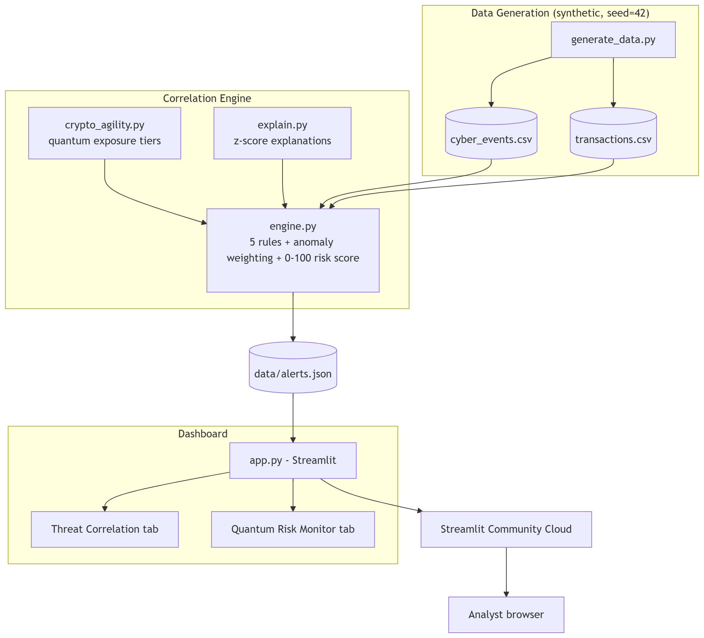

# SENTINEL-Q — Correlated Threat & Quantum Risk Intelligence for Banking

The SOC sees the login. The fraud team sees the transfer. Nobody sees both — SENTINEL-Q sees both.

## The problem

Banking security and payments teams run on siloed telemetry: the SOC monitors authentication and network events, while the fraud team monitors transaction flows, and the two rarely talk in real time. An attacker who compromises a session and then moves money looks like two unrelated, sub-threshold events instead of one attack. This gap is compounded by Harvest-Now-Decrypt-Later (HNDL) risk, where data encrypted with quantum-vulnerable cryptography today can be exfiltrated now and decrypted once quantum computing matures, with no alert firing under either team's rules alone. Correlating identity, network, and transactional signals into a single risk view is what closes that gap.

## What SENTINEL-Q does

- Generates synthetic bank telemetry covering 5 labeled attack scenarios for safe, reproducible testing
- Runs a correlation engine combining 5 transparent, explainable rules with IsolationForest anomaly weighting
- Produces a single 0–100 risk score per event by combining rule output and anomaly weighting
- Surfaces alerts in a Streamlit SOC dashboard with plain-English explanations, contributing z-score features, and an event timeline
- Includes a Quantum Risk Monitor tab that classifies systems by crypto posture and flags quantum exposure
- Fires Harvest-Now-Decrypt-Later (HNDL) alerts only when vulnerable crypto and exfiltration-shaped behaviour occur together

## Architecture



```
generate_data.py
      ↓
engine.py (transparent rules + IsolationForest anomaly weighting)
      ↓
alerts.json
      ↓
app.py dashboard  →  SOC Alert View / Quantum Risk Monitor
```

## Quickstart

```bash
git clone <REPO URL>
cd sentinel-q
python -m venv .venv

# Windows
.venv\Scripts\activate

# Mac/Linux
source .venv/bin/activate

pip install -r requirements.txt
python generate_data.py
python engine.py
streamlit run app.py
```

## Live demo

https://sentinel-q-zjrt44jq29pa4uruuhbrkv.streamlit.app

The dashboard above is deployed live on Streamlit Community Cloud and runs entirely on the synthetic dataset generated by `generate_data.py`.

## The five attack scenarios we detect

- **Account takeover** — a legitimate identity is compromised and used to authenticate as the real customer
- **Credential stuffing** — bulk automated login attempts using leaked or guessed credentials
- **Dormant-account burst** — a long-inactive account suddenly generates a burst of activity
- **HNDL exfiltration** — data exfiltration from a system using quantum-vulnerable cryptography, flagged for future decryption risk
- **Impossible travel** — logins from geographically incompatible locations within a timeframe that rules out real travel

## Security & privacy

- All data used in this project is 100% synthetic — no real customer or transaction data
- Customer identifiers are pseudonymized using SHA-256 before display
- Runs on plain Python with no cloud dependency required to operate, so it is on-premise-capable
- Explainable by design — alerts are produced by transparent rules, not opaque model output

See [PRIVACY.md](PRIVACY.md) for full detail on the pseudonymization mechanism and its limitations.

## Compliance alignment

SENTINEL-Q's dashboard and alerting design map to the SOC and cyber-crisis expectations of the RBI Cyber Security Framework (2016) and to the data minimisation and purpose limitation principles of the DPDP Act (2023). The full control-by-control mapping is maintained in [PRIVACY.md](PRIVACY.md), not duplicated here.

## Team

- Shreya 
- Devayani
- Meghna 
- Hitha